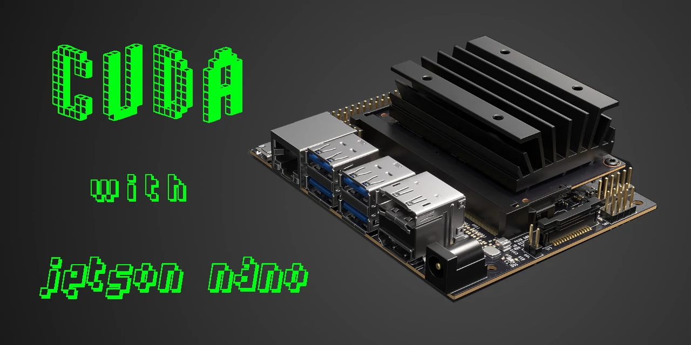

# explore-cuda-jetson-nano

 This repos is a consequence that I learned CUDA thanks to [this course](https://cs.famaf.unc.edu.ar/~nicolasw/Docencia/CP/2020/), and heavily inspired by [this book](https://github.com/PacktPublishing/Learn-CUDA-Programming).
